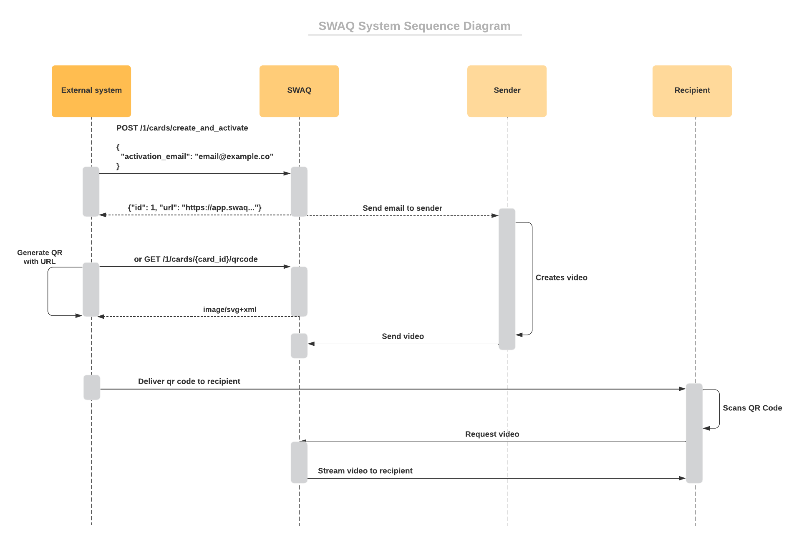

# SWAQ API Documentation

API integration documentation for [SWAQ](https://swaq.co/).

This API will allow you to generate unique qr codes as digital images for "self-printing" or to assign pre-printed qr codes to customer email addresses and order references.

You can request access to our demo environment [here](https://swaq.co/sell-swaq/#contact).

We have a [Swagger UI](https://api.stg.swaq.ddn.amalgama.co/api-docs/index.html?urls.primaryName=Merchant%20API%20V1%20Docs) were you can try the endpoints.

## Table of Contents
  * [Language](#language)
  * [API key](#api-key)
  * [Self printed integration](#self-printed-integration)
    * [Create and activate](#create-and-activate)
    * [Generate qr code](#generate-qr-code)
  * [Pre-printed integration](#pre-printed-integration)
    * [List qr codes](#list-qr-codes)
    * [Activate qr code](#activate-qr-code)
  * [Swagger UI](#swagger-ui)

## Language

- **Sender** is the user (the gift buying customer) that is responsible for creating and uploading the video that is linked to the QR code.
- **Recipient** is the user that scans the qr code and sees the `Sender` video.
- **Card** is the term used in our system to refer to a unique QR code.
- **Activation** is the process of assigning the `Sender` responsibility to a user by email with a link to create, customize and upload a video to a unique qr code.

## API key

To make use of the endpoints we will provide an API key.

You need to send the api key in the `Authorization: Bearer` header:
``` sh
curl  -X POST \
  'https://api.stg.swaq.ddn.amalgama.co/1/cards/create_and_activate' \
  --header 'Accept: */*' \
  --header 'Authorization: Bearer [your_api_key]' \
  --header 'Content-Type: application/json' \
  --data-raw '{
    "activation_email": "email@example.com"
} 
```

## Self printed integration



### Create and activate
For the self printed integration you can send a `POST` request to the path `/1/cards/create_and_activate`, this will create a card in our system and trigger an email to the `activation_email` provided with the link to create and upload the sender video. The request should look like this:

``` sh
curl  -X POST \
  'https://api.stg.swaq.ddn.amalgama.co/1/cards/create_and_activate' \
  --header 'Accept: */*' \
  --header 'Authorization: Bearer {your_api_key}' \
  --header 'Content-Type: application/json' \
  --data-raw '{
    "activation_email": "email@example.com"
  }' 
```
This will return an `url`, which can be used to generate a qr code, and an `id`.

### Generate qr code

Also we provide an endpoint to generate a qr code image for the `url` using the `card_id` `/1/cards/{card_id}/qrcode`, like this:

``` sh
curl  -X GET \
  'https://api.stg.swaq.ddn.amalgama.co/1/cards/{card_id}/qrcode' \
  --header 'Accept: */*' \
  --header 'Authorization: Bearer {your_api_key}'
```

This qr code should be printed and sent with the gift so the `Recipient` can scan it.

## Pre-printed integration

We will provide pre-printed qr codes so you can add them to packages in fulfillment. You can request some [here](https://swaq.co/sell-swaq/#contact).

### List qr codes

This endpoint provides the list of remaining available qr codes assigned to a merchant account.

``` sh
curl  -X GET \
  'https://api.stg.swaq.ddn.amalgama.co/1/cards?per_page=1&filter[available_for_activation_eq]=true' \
  --header 'Accept: */*' \
  --header 'Authorization: Bearer {your_api_key}'
```

### Activate qr code

You can send a `POST` request to the path `/1/cards/{card_id}/activate`, this will trigger an email to the `activation_email` provided with the link to create and upload the sender video. The request should look like this:

``` sh
curl  -X POST \
  'https://api.stg.swaq.ddn.amalgama.co/1/cards/{card_id}/activate' \
  --header 'Accept: */*' \
  --header 'Authorization: Bearer {your_api_key}' \
  --header 'Content-Type: application/json' \
  --data-raw '{
    "activation_email": "example@.co",
    "order_reference": null
  }'
```

## Swagger UI

You can try this endpoints [here](https://api.stg.swaq.ddn.amalgama.co/api-docs/index.html?urls.primaryName=Merchant%20API%20V1%20Docs).

Press the `Authorize` button, enter your `API key` and you are ready to go.